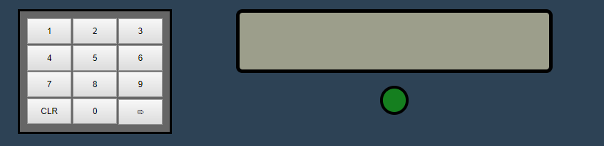
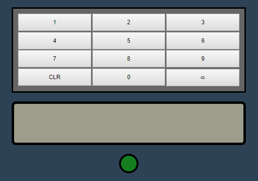

# Roy-Ren-Challenge-IAG

## How to run this project

1. npm install
2. npm start 
3. http://localhost:3000/

## New Responsive feature

### I added responsive feature for this application with CSS media query, normally when the screen size is greater than 600px, it shows:

### When the screen size is less or equal than 600px, it shows:

